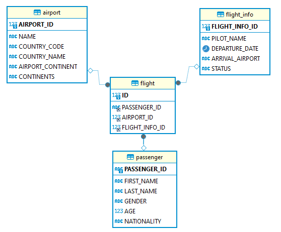

# Manual Técnico  
#### Universidad de San Carlos de Guatemala  
#### Facultad de Ingeniería  
#### Seminario de Sistemas 2  

## Práctica 1   
### Proceso ETL  

#### Nombre y carnet 
- Yeinny Melissa Catalán de León    - 202004725  

Guatemala, Agosto 2024.  
___
  
## Introducción  
___
Este manual técnico tiene como finalidad  que el personal Técnico especializado encargado de las actividades de mantenimiento, revisión, solución de problemas y configuración del programa de llamadas de sistema pueda realizarlo de una manera óptima, indicando cada uno de los aspectos de la aplicación.  
  
La aplicación tiene como objetivo realizar un proceso ETL completo sobre información de vuelos.  
  
## Objetivos  
___
### General  
- Brindar al lector una guía que contenga la información del manejo de clases, atributos y métodos para facilitar futuras actualizaciones y futuras modificaciones realizadas por terceros.  
 
### Específicos  
- Mostrar al lector una descripción completa sobre las características del programa.  

- Proporcionar al lector una concepción y explicación técnica - formal de los procesos y relaciones entre métodos y atributos que conforman la parte operativa de la aplicación.  

## Alcances del Sistema  
___
Este sistema fue hecho para entender los procesos ETL aplicados a casos reales.  

## Software Utilizado
___
- **Sistema Operativo:** Windows 10  
- **IDE:** Visual Studio Code  
- **Lenguaje de programación utilizado:** Python  
- **Base de Datos:** SQL Server  

## Lógica utilizada en cada parte del menú  
___
### Borrar Modelo  

Para realizar el borrado del modelo se utilizó la instrucción __DROP__ para borrar cada tabla de forma individual. 

### Crear Modelo  

Para la creación del modelo se utilizó la instrucción __CREATE__ para crear cada tabla de forma individual junto con sus atributos. 

### Extraer información 

Al momento de extraer la información se le solicita al usuario el archivo .csv de entrada y se analiza y guarda en una tabla temporal. 

### Cargar información 

En este paso la información se carga la información en las tablas reales que se ejecutaron al momento de la creación del modelo. 

### Realizar Consultas

Cuando se selecciona esta opción se escribe o sobre escribe el archivo de salida con todas las consultas solicitadas. 

### Modelo de la base de datos

Las tablas de dimensiones son 3:
Dimensión de Pasajeros
**Descripción:** Esta tabla contiene información sobre los pasajeros. Cada registro representa un pasajero con detalles como nombre, género, edad y nacionalidad.
Dimensión de Aeropuertos
**Descripción:** Esta tabla almacena información sobre los aeropuertos, incluyendo su nombre, código de país, nombre del país, continente y continentes asociados.
Dimensión de Información de vuelo
**Descripción:** Contiene información específica sobre los vuelos, como el nombre del piloto, la fecha de salida, el aeropuerto de llegada y el estado del vuelo.

Y la tabla de hechos es la de vuelos:
Hechos Vuelo
**Descripción:** Esta tabla actúa como la tabla de hechos que almacena los registros de vuelos. Cada entrada en esta tabla representa un vuelo específico asociado a un pasajero, un aeropuerto y un conjunto de información sobre el vuelo.

## Conclusión
___
La realización de esta práctica ayuda a entender como funcionan los procesos ETL a través de un ejemplo de la vida real.